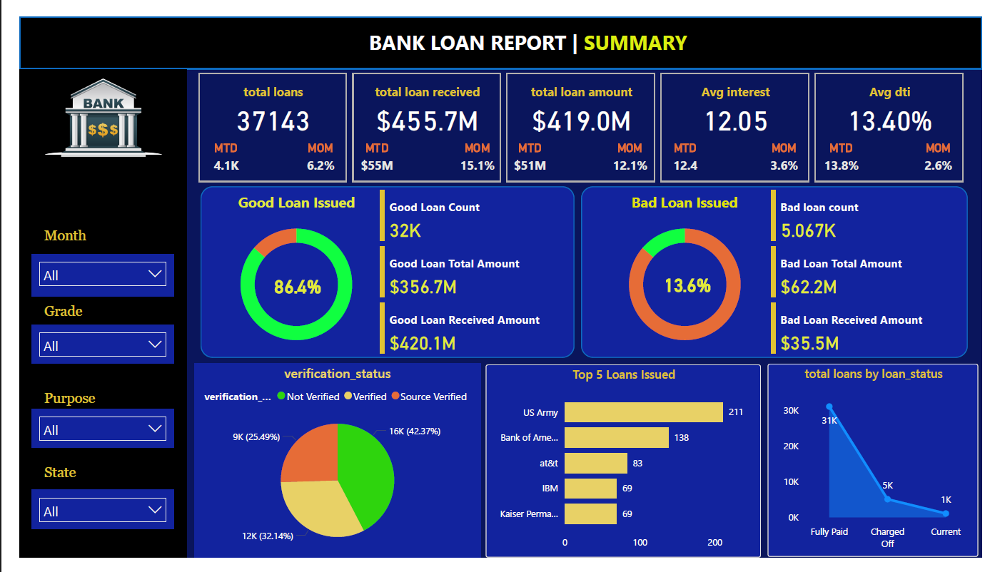
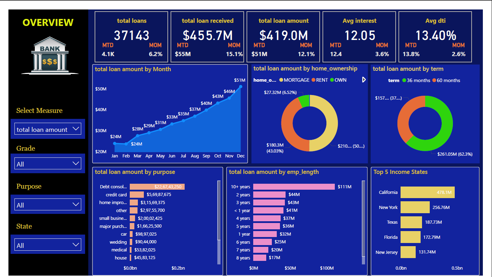

# 📊 Financial Loan Data Analysis

An end-to-end project that analyzes financial loan data using **Python (pandas,matplotlib)** and **SQL (SQL Server)**. The project includes detailed data preprocessing, borrower profiling, default risk analysis, and visual storytelling using Python-based charts and Power BI.

---
## 📁 Project Overview

This project uncovers key patterns in loan issuance and repayment behavior. It includes:

- Default analysis by income, grade, and state  
- Loan risk profiling based on purpose and job titles  
- Recovery ratio for charged-off loans  
- Monthly and categorical loan trends  
- Interactive visualizations using matplotlib and seaborn
- Loan issuance trends over time
- Borrower characteristics and their relationship to default risk
- Loan performance across different credit grades

## 🧩 Project Pipeline

1. **Data Cleaning & Preprocessing**  
   - Imported Excel data into Python using `pandas`.
   - Handled missing values and formatted columns.
   - Derived new features like convert state_code to state name and loan month .

2. **Exploratory Data Analysis (Python)**  
   - Visualized loan distribution, grade-wise trends, and borrower patterns using `matplotlib`.
    📄 File: [`financial_loan.ipynb`](./financial_loan.ipynb)

## Performed advanced analytics using SQL scripts:

#### ✅ [`loan_analysis_1.sql`](./loan_analysis_1.sql)
- Total loan by state  
- Average interest by grade  
- Top loan purposes  
- Monthly issuance trends  
- Debt-to-income by employment length  
- Default rate by ownership

#### ✅ [`loan_analysis-2.sql`](./loan_analysis-2.sql)
- Loan status breakdown by grade (pivot)  
- High-risk states by average interest  
- Top employee titles by loan amount  
- Month-over-month borrower growth  
- Home ownership trend (pivot)

#### ✅ [`loan_analysis-3.sql`](./loan_analysis-3.sql)
- Default rates by income group, state, and purpose  
- Recovery ratios for charged-off loans  
- Loan performance by grade  
- State-wise purpose dominance

## 💡 Key Insights

1. **Low-income borrowers and certain loan purposes** (like small business and education) had the highest default rates.  
2. **Grade A and B loans** had the lowest defaults and highest recovery, while **Grades E to G** were the riskiest.  
3. **Some states** (like Nevada and Mississippi) had very high default rates, even with fewer total loans.  
4. **People who rent or selected 'Other' as home ownership** type defaulted more than those who own homes or have mortgages.  
5. **Higher interest rates** were clearly linked to higher-risk borrowers and lower credit grades.  
6. **Common loan purposes** like debt consolidation still showed risk in lower grades, meaning purpose alone doesn't guarantee low risk.

 ## 📊 Power BI Dashboard

Created an **interactive Power BI dashboard** to present key findings:

- 📈 Monthly Loan Issuance & Repayment  
- 💸 Default Rates by Grade, Purpose & State  
- 🏠 Ownership & Risk Breakdown  
- 🌐 Heatmaps for state-wise performance  
- 🔄 Dynamic filters for year, grade, and income level

🖼️ Dashboard Screenshots :  
  

---
## 🛠️ Tech Stack

| Tool            | Purpose                              |
|-----------------|--------------------------------------|
| **Python**      | Data cleaning, feature engineering   |
| **Pandas**      | Data manipulation                    |
| **Matplotlib**  | Data visualization (charts, plots)   |
| **SQL Server**  |Basic To Advanced queries and analysis|
| **Excel**      | Dataset source                       |
| **Power BI     | visualization                        |

---
## 📁 Repository Files

| File Name                          | Description                                                        |
|-----------------------------------|--------------------------------------------------------------------|
| [`financial_loan.ipynb`](./financial_loan.ipynb) | Python notebook for data preprocessing and EDA            |
| [`loan_analysis_1.sql`](./loan_analysis_1.sql)   | Basic SQL: state totals, loan purposes, interest trends   |
| [`loan_analysis-2.sql`](./loan_analysis-2.sql)   | Ranking, pivoting, borrower trends, grade analysis        |
| [`loan_analysis-3.sql`](./loan_analysis-3.sql)   | Risk segmentation, defaults, and recovery metrics         |
| `loan_summary.png`            | Power BI dashboard screenshot                                 |
| `loan_overview.png`            | Power BI dashboard screenshot   

